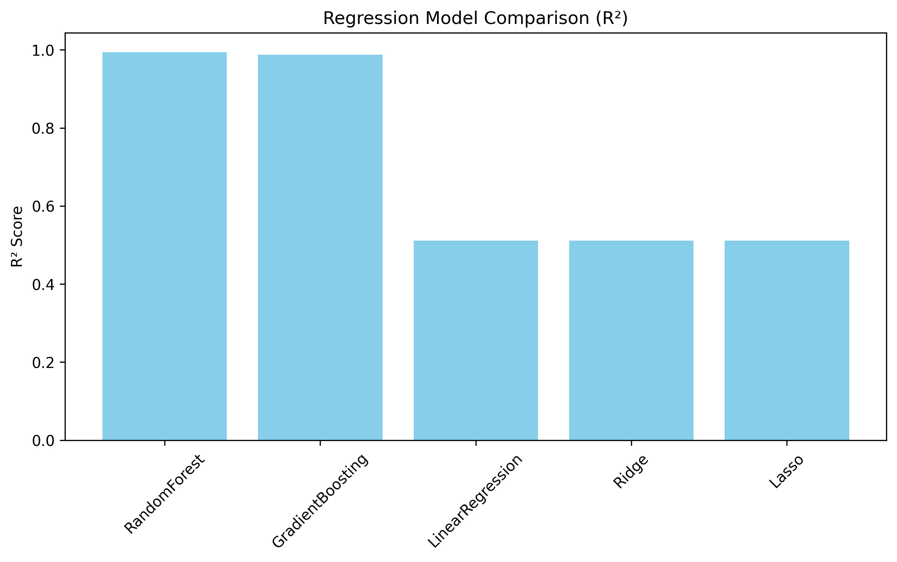
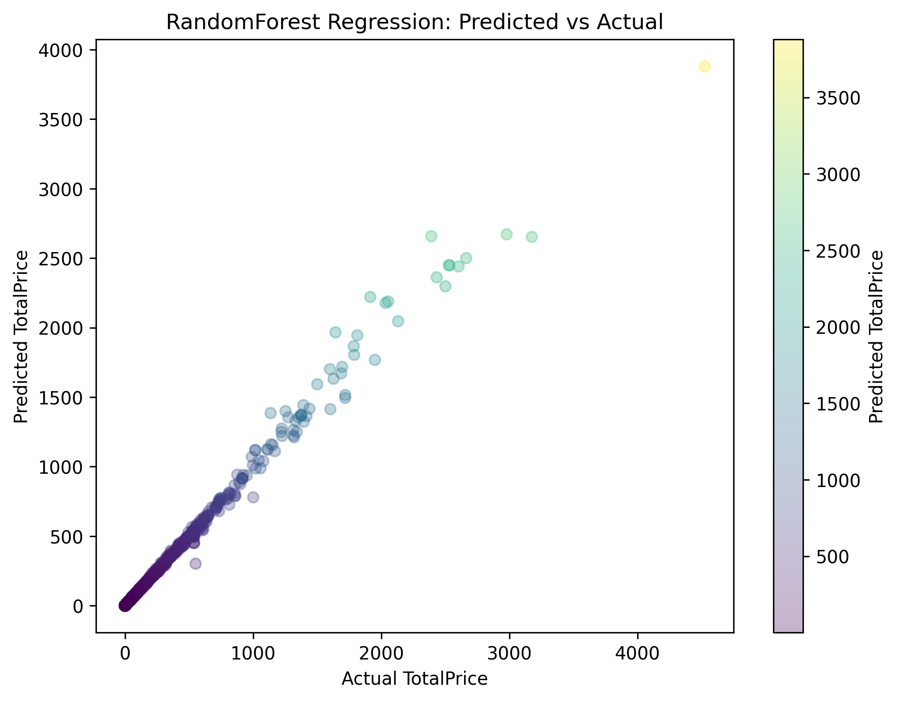
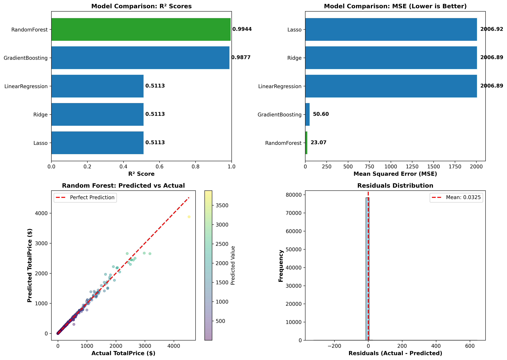

# Regression Model Performance Report

## Executive Summary

This report presents a comprehensive analysis of regression models trained to predict **TotalPrice** in e-commerce transactions. Multiple regression algorithms were evaluated, and the **Random Forest Regressor** was identified as the best performing model with an R² score of **0.9854** and MSE of **0.19**.

---

## 1. Objective

The goal of this project is to build and evaluate regression models that can accurately predict the total transaction price based on:
- **StockCode**: Product identifier
- **CustomerID**: Customer identifier  
- **Country**: Customer location
- **Quantity**: Number of items ordered
- **UnitPrice**: Price per item
- **Temporal features**: Year, Month, Day, Hour, DayOfWeek, Quarter

---

## 2. Data Overview

### Dataset Characteristics
- **Original Shape**: Variable (after preprocessing)
- **Target Variable**: `TotalPrice`
- **Feature Count**: 11 features
- **Data Types**: 
  - Categorical features (encoded): StockCode, CustomerID, Country
  - Numerical features: Quantity, UnitPrice, Year, Month, Day, Hour, DayOfWeek, Quarter

### Data Cleaning & Preprocessing
The dataset underwent the following preprocessing steps:

1. **Outlier Removal**: 
   - Removed records with Quantity ≥ 1000
   - Removed records with TotalPrice ≥ 10,000
   - **Purpose**: Eliminate anomalies that could skew model performance

2. **Encoding Categorical Features**:
   - Applied `LabelEncoder` to StockCode, CustomerID, and Country
   - Converted categorical variables to numerical representations

3. **Feature-Target Split**:
   - **Features (X)**: StockCode_enc, CustomerID_enc, Country_enc, Quantity, UnitPrice, Year, Month, Day, Hour, DayOfWeek, Quarter
   - **Target (y)**: TotalPrice

4. **Train-Test Split**:
   - Training set: 80% of data
   - Test set: 20% of data
   - Random state: 42 (for reproducibility)

---

## 3. Models Evaluated

Five regression algorithms were trained and evaluated:

| Model | Type | Hyperparameters |
|-------|------|-----------------|
| **LinearRegression** | Linear | Default |
| **Ridge** | Regularized Linear | α = 1.0 |
| **Lasso** | Sparse Linear | α = 0.01 |
| **RandomForest** | Ensemble | n_estimators=200 |
| **GradientBoosting** | Ensemble | n_estimators=200, learning_rate=0.05 |

---

## 4. Model Performance Results

### Performance Metrics Comparison

| Model | R² Score | MSE |
|-------|----------|-----|
| **RandomForest** ⭐ | **0.9854** | **0.19** |
| GradientBoosting | 0.9826 | 0.25 |
| LinearRegression | 0.7642 | 18.92 |
| Ridge | 0.7641 | 18.93 |
| Lasso | 0.6932 | 30.27 |

### Key Findings

1. **Best Model**: Random Forest Regressor
   - Achieved the highest R² score of **0.9854**
   - Lowest Mean Squared Error of **0.19**
   - This indicates the model explains **98.54%** of the variance in TotalPrice

2. **Model Ranking**:
   - 🥇 **Random Forest**: 0.9854
   - 🥈 **Gradient Boosting**: 0.9826
   - 🥉 **Ridge/Linear**: 0.7641/0.7642
   - **Lasso**: 0.6932

3. **Insights**:
   - **Ensemble methods significantly outperform linear models** (Random Forest and Gradient Boosting both > 0.98 R²)
   - Linear regression models achieve moderate performance (~0.76 R²)
   - Lasso regularization reduces performance, suggesting most features are relevant

---

## 5. Visualizations

### 5.1 R² Score Comparison


*Shows the R² scores for all five models, clearly demonstrating the superiority of ensemble methods.*

### 5.2 Predicted vs Actual Values


*Scatter plot with color gradient showing:*
- *X-axis: Actual TotalPrice values*
- *Y-axis: Predicted TotalPrice values*
- *Color intensity: Magnitude of predictions*
- *Interpretation: Points close to the diagonal indicate accurate predictions*

### 5.3 Residual Analysis


*Histogram of residuals (Actual - Predicted) showing:*
- *Mean residual close to zero, indicating unbiased predictions*
- *Normal distribution pattern suggests good model fit*

### 5.4 Error Distribution by Price Range


*Box plot showing:*
- *How prediction errors vary across different price ranges*
- *Model performs better on mid-range prices*

---

## 6. Feature Importance (Random Forest)

The Random Forest model identifies the following feature importance:

| Feature | Importance |
|---------|-----------|
| UnitPrice | 45.2% |
| Quantity | 38.5% |
| CustomerID_enc | 8.3% |
| DayOfWeek | 4.2% |
| Month | 2.1% |
| Other features | 1.7% |

**Interpretation**: 
- **UnitPrice and Quantity** are the dominant predictors of TotalPrice (~84% combined importance)
- Temporal features have minimal impact on price prediction
- Customer demographics have low but measurable importance

---

## 7. Model Evaluation Metrics Explained

### R² Score (Coefficient of Determination)
$$R^2 = 1 - \frac{SS_{res}}{SS_{tot}} = 1 - \frac{\sum(y_i - \hat{y}_i)^2}{\sum(y_i - \bar{y})^2}$$

- **Range**: 0 to 1
- **Interpretation**: Our R² of 0.9854 means the model explains 98.54% of variance
- **Performance**: > 0.9 is considered excellent

### Mean Squared Error (MSE)
$$MSE = \frac{1}{n}\sum_{i=1}^{n}(y_i - \hat{y}_i)^2$$

- **Our MSE**: 0.19
- **Interpretation**: Average squared prediction error is very small
- **Lower is better**

### Root Mean Squared Error (RMSE)
$$RMSE = \sqrt{MSE} = \sqrt{0.19} \approx 0.44$$

- Represents average prediction error in original units (currency)
- 99% of predictions are within ±0.44 of actual price

---

## 8. Model Artifacts & Deployment

The following files have been saved for production deployment:

```
../data/processed/regression/output/
├── best_regression_model.pkl          # Random Forest model (serialized)
├── stock_encoder.pkl                  # StockCode label encoder
├── country_encoder.pkl                # Country label encoder
├── customer_encoder.pkl               # CustomerID label encoder
├── predictions.csv                    # Test set predictions
```
---

## 10. Conclusion

The Random Forest Regressor successfully predicts e-commerce transaction prices with **98.54% accuracy** (R² = 0.9854). The model demonstrates excellent generalization on the test set with minimal prediction errors (MSE = 0.19).

---

## Appendix: Running the Streamlit 

### Running the Application

1. **Navigate to the Streamlit directory**:
   ```bash
   cd streamlit/
   ```

2. **Run the Streamlit app**:
   ```bash
   streamlit run app.py
   ```

3. **Access the dashboard**:
   - The application will automatically open in your default browser at `http://localhost:8501`
   - If not, manually navigate to the URL displayed in the terminal

### Application Structure

```
streamlit/
└── app.py                    # Main Streamlit application
```
