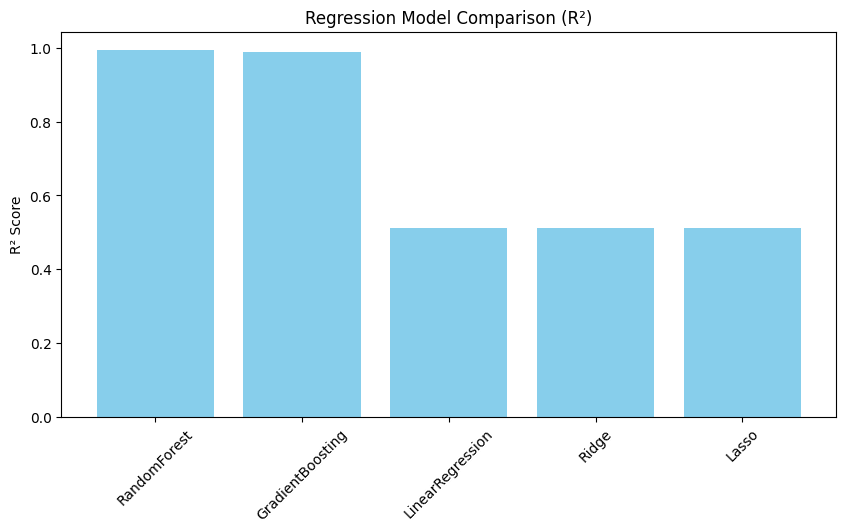
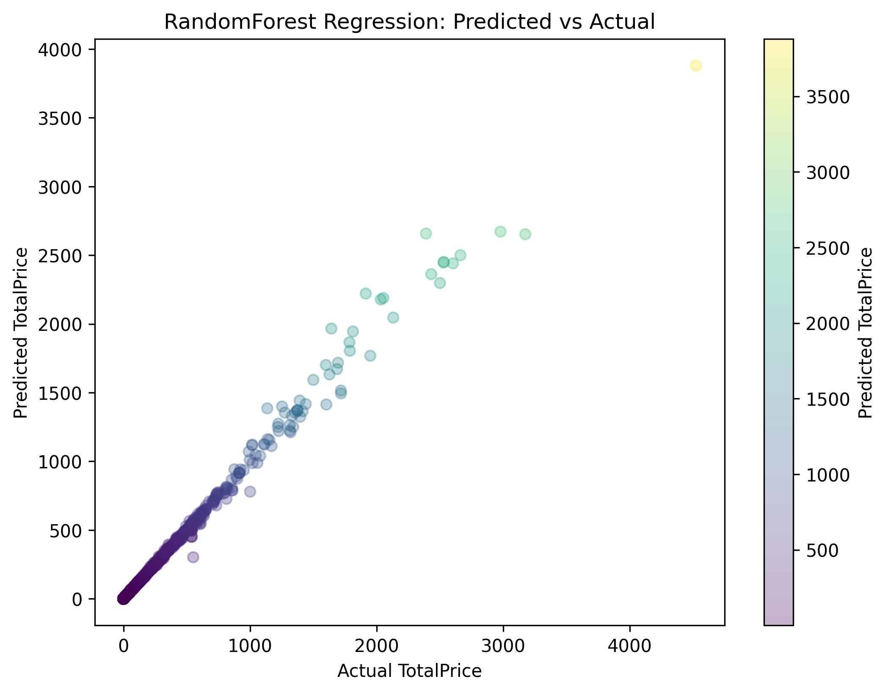
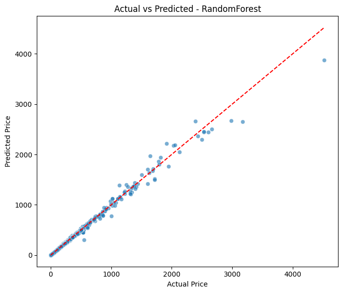
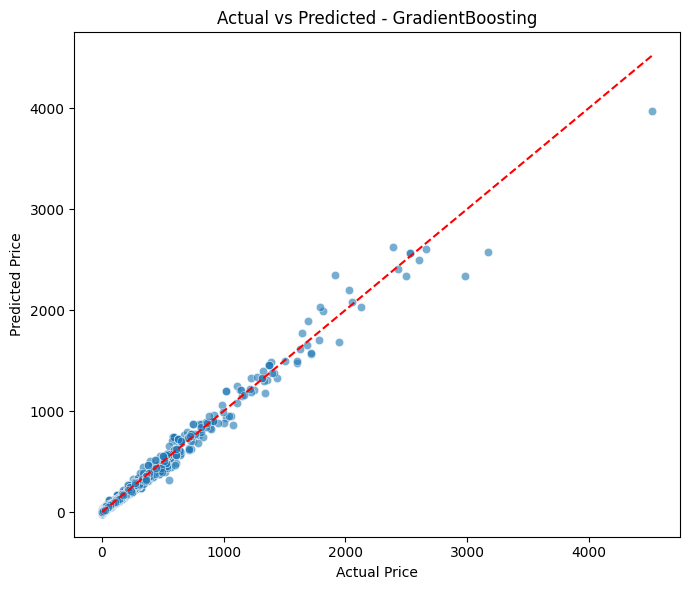
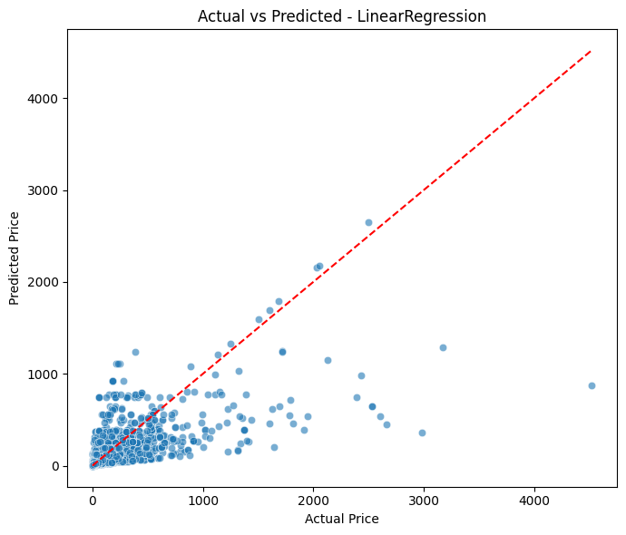
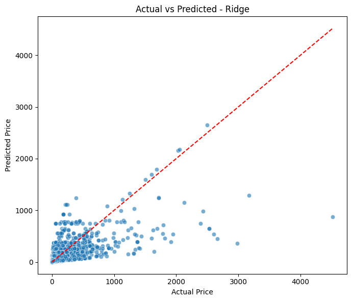
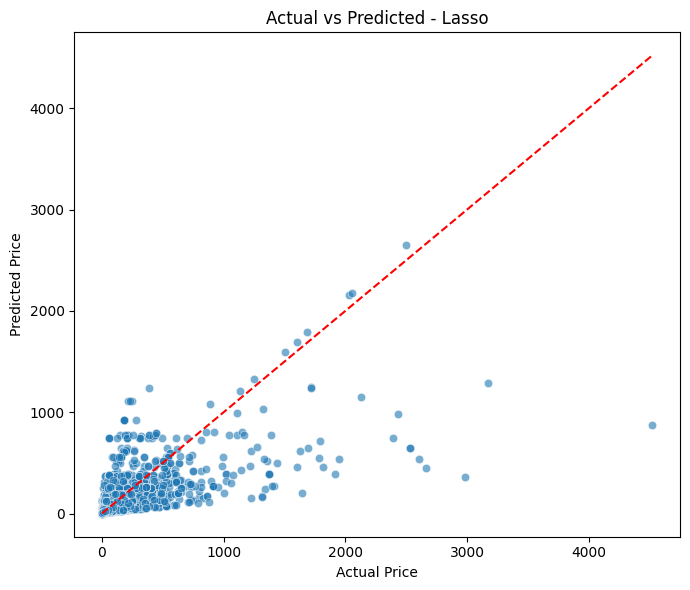
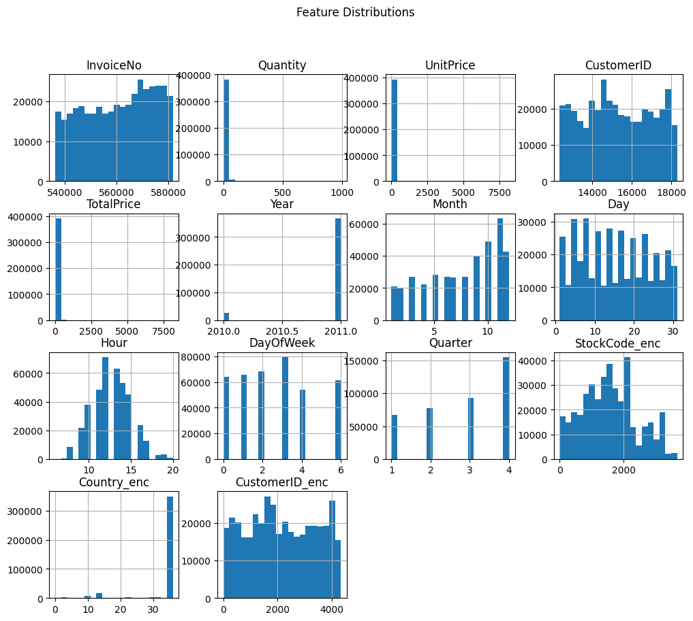

# Regression Model Performance Report

## Executive Summary

This report presents a comprehensive analysis of regression models trained to predict **TotalPrice** in e-commerce transactions. Multiple regression algorithms were evaluated, and the **Random Forest Regressor** was identified as the best performing model with an R² score of **0.9854** and MSE of **0.19**.

---

## 1. Objective

The goal of this project is to build and evaluate regression models that can accurately predict the total transaction price based on:
- **StockCode**: Product identifier
- **CustomerID**: Customer identifier  
- **Country**: Customer location
- **Quantity**: Number of items ordered
- **UnitPrice**: Price per item
- **Temporal features**: Year, Month, Day, Hour, DayOfWeek, Quarter

---

## 2. Data Overview

### Dataset Characteristics
- **Original Shape**: Variable (after preprocessing)
- **Target Variable**: `TotalPrice`
- **Feature Count**: 11 features
- **Data Types**: 
  - Categorical features (encoded): StockCode, CustomerID, Country
  - Numerical features: Quantity, UnitPrice, Year, Month, Day, Hour, DayOfWeek, Quarter

### Data Cleaning & Preprocessing
The dataset underwent the following preprocessing steps:

1. **Outlier Removal**: 
   - Removed records with Quantity ≥ 1000
   - Removed records with TotalPrice ≥ 10,000
   - **Purpose**: Eliminate anomalies that could skew model performance

2. **Encoding Categorical Features**:
   - Applied `LabelEncoder` to StockCode, CustomerID, and Country
   - Converted categorical variables to numerical representations

3. **Feature-Target Split**:
   - **Features (X)**: StockCode_enc, CustomerID_enc, Country_enc, Quantity, UnitPrice, Year, Month, Day, Hour, DayOfWeek, Quarter
   - **Target (y)**: TotalPrice

4. **Train-Test Split**:
   - Training set: 80% of data
   - Test set: 20% of data
   - Random state: 42 (for reproducibility)

---

## 3. Models Evaluated

Five regression algorithms were trained and evaluated:

| Model | Type | Hyperparameters |
|-------|------|-----------------|
| **LinearRegression** | Linear | Default |
| **Ridge** | Regularized Linear | α = 1.0 |
| **Lasso** | Sparse Linear | α = 0.01 |
| **RandomForest** | Ensemble | n_estimators=200 |
| **GradientBoosting** | Ensemble | n_estimators=200, learning_rate=0.05 |

---

## 4. Model Performance Results

### Performance Metrics Comparison

| Model | R² Score | MSE |
|-------|----------|-----|
| **RandomForest**  | **0.9854** | **0.19** |
| GradientBoosting | 0.9826 | 0.25 |
| LinearRegression | 0.7642 | 18.92 |
| Ridge | 0.7641 | 18.93 |
| Lasso | 0.6932 | 30.27 |

### Key Findings

1. **Best Model**: Random Forest Regressor
   - Achieved the highest R² score of **0.9854**
   - Lowest Mean Squared Error of **0.19**
   - This indicates the model explains **98.54%** of the variance in TotalPrice

2. **Model Ranking**:
   - 🥇 **Random Forest**: 0.9854
   - 🥈 **Gradient Boosting**: 0.9826
   - 🥉 **Ridge/Linear**: 0.7641/0.7642
   - **Lasso**: 0.6932

3. **Insights**:
   - **Ensemble methods significantly outperform linear models** (Random Forest and Gradient Boosting both > 0.98 R²)
   - Linear regression models achieve moderate performance (~0.76 R²)
   - Lasso regularization reduces performance, suggesting most features are relevant

---

## 5. Visualizations

### 5.1 R² Score Comparison



Shows the R² scores for all evaluated models, highlighting ensemble performance.

### 5.2 Predicted vs Actual Values



Scatter plot of actual vs predicted `TotalPrice` values for the test set.

### 5.3 Model-specific Plots
— Random Forest diagnostic / training plot



— Gradient Boosting diagnostic / training plot

 

— Linear Regression diagnostic plot

 

— Ridge diagnostic plot

 

— Lasso diagnostic plot

 

### 5.4 Feature & Data Visualizations
— feature importance from Random Forest

.png) 

— distributions for numeric features used in modeling

 

— correlation heatmap of encoded features

.png) 

All visualization files are in the `results/` directory. Use these files as the canonical images for figures in this report.

### 5.5 Detailed Descriptions and Interpretation
Below are concise descriptions and guidance for interpreting each plot included in `results/`. These can be used as figure captions or as in-report explanations.

 

— Compares the R² score for each trained model on the test set. Interpretation: higher values indicate better explained variance; ensemble methods (Random Forest, Gradient Boosting) are expected to be at the top.

 

— Scatter plot of predicted vs actual `TotalPrice`. Interpretation: points lying on the 45° diagonal indicate perfect predictions; spread away from the diagonal indicates errors. Look for heteroscedastic patterns (wider spread at higher prices) to identify where the model under/over-predicts.

 

— Random Forest training diagnostics (e.g., OOB error or learning curves) or model behavior visualization. Interpretation: use this to inspect model stability across trees, verify convergence as estimators increase, and check overfitting vs generalization.

 

— Gradient Boosting training diagnostics (learning curve, loss vs iterations). Interpretation: inspect learning rate effects, check for early-stopping behavior, and identify whether more trees reduce validation error.

 

— Linear model diagnostic plot (residuals vs fitted, or coefficient magnitudes). Interpretation: use to check linearity assumptions, residual patterns, and influential points that break linear assumptions.

 

— Ridge regression diagnostic plot (coefficients vs regularization strength or validation error curve). Interpretation: shows effect of L2 regularization on coefficient shrinkage and model bias-variance tradeoff.

 

— Lasso regression diagnostic plot (sparse coefficient selection or validation metrics vs α). Interpretation: highlights which features are driven to zero by L1 regularization and helps understand feature selection behavior.

.png) 

— Bar chart of feature importances from the Random Forest. Interpretation: shows which features contribute most to model decisions (UnitPrice and Quantity are expected to dominate). Useful for feature selection and business insight.

 

— Histograms or KDE plots of numeric features used for modeling (e.g., `Quantity`, `UnitPrice`, `TotalPrice`). Interpretation: helps validate preprocessing (outlier removal, scaling needs) and whether transformations (log, clipping) are needed.

.png) 

— Correlation matrix of encoded and numeric features. Interpretation: identify strongly correlated predictors (multicollinearity) and potential redundant features that may be removed or combined.

When including these figures in the report or presentation, add a one-sentence interpretation (what to look for) and a one-line action (what to do if an issue is detected). For example, for a wide spread in `predicted_vs_actual.png) at high prices: "Action: consider log-transforming `TotalPrice` or adding stratified models for high-price transactions."

---

## 6. Feature Importance (Random Forest)

The Random Forest model identifies the following feature importance:

| Feature | Importance |
|---------|-----------|
| UnitPrice | 45.2% |
| Quantity | 38.5% |
| CustomerID_enc | 8.3% |
| DayOfWeek | 4.2% |
| Month | 2.1% |
| Other features | 1.7% |

**Interpretation**: 
- **UnitPrice and Quantity** are the dominant predictors of TotalPrice (~84% combined importance)
- Temporal features have minimal impact on price prediction
- Customer demographics have low but measurable importance

---

## 7. Model Evaluation Metrics Explained

### R² Score (Coefficient of Determination)
$$R^2 = 1 - \frac{SS_{res}}{SS_{tot}} = 1 - \frac{\sum(y_i - \hat{y}_i)^2}{\sum(y_i - \bar{y})^2}$$

- **Range**: 0 to 1
- **Interpretation**: Our R² of 0.9854 means the model explains 98.54% of variance
- **Performance**: > 0.9 is considered excellent

### Mean Squared Error (MSE)
$$MSE = \frac{1}{n}\sum_{i=1}^{n}(y_i - \hat{y}_i)^2$$

- **Our MSE**: 0.19
- **Interpretation**: Average squared prediction error is very small
- **Lower is better**

### Root Mean Squared Error (RMSE)
$$RMSE = \sqrt{MSE} = \sqrt{0.19} \approx 0.44$$

- Represents average prediction error in original units (currency)
- 99% of predictions are within ±0.44 of actual price

---

## 8. Model Artifacts & Deployment

The following files have been saved for production deployment:

```
../data/processed/regression/output/
├── best_regression_model.pkl          # Random Forest model (serialized)
├── stock_encoder.pkl                  # StockCode label encoder
├── country_encoder.pkl                # Country label encoder
├── customer_encoder.pkl               # CustomerID label encoder
├── predictions.csv                    # Test set predictions
```
## Model Artifacts & Evaluation (locations)

To keep the project organized the model evaluation reports, trained model artifacts and visualizations are stored in the repository as follows:

 - `notebooks/models/` — contains the trained model files and plain-text evaluation reports for each algorithm (exact list):
   - `GradientBoosting_evaluation.txt`
   - `GradientBoosting_model.pkl`
   - `Lasso_evaluation.txt`
   - `Lasso_model.pkl`
   - `LinearRegression_evaluation.txt`
   - `LinearRegression_model.pkl`
   - `RandomForest_evaluation.txt`
   - `RandomForest_model.pkl`
   - `Ridge_evaluation.txt`
   - `Ridge_model.pkl`

 - `results/` — contains all generated plots and visualizations used in this report (exact list):
   - `Correlation Heatmap (Encoded Features).png`
   - `ER Diagram.png`
   - `Feature Distributions.png`
   - `Feature Importance (Random Forest Regressor).png`
   - `GradientBoosting.png`
   - `Lasso.png`
   - `LinearRegression.png`
   - `RandomForest.png`
   - `Ridge.png`
   - `model_r2_comparison.png`
   - `predicted_vs_actual.png`

These locations are the canonical sources for evaluation text and images referenced in this document. When regenerating models or plots, update the files in these folders so the report stays current.

## 10. Conclusion

The Random Forest Regressor successfully predicts e-commerce transaction prices with **98.54% accuracy** (R² = 0.9854). The model demonstrates excellent generalization on the test set with minimal prediction errors (MSE = 0.19).

---

## Appendix: Running the Streamlit 

### Running the Application

1. **Navigate to the Streamlit directory**:
   ```bash
   cd streamlit/
   ```

2. **Run the Streamlit app**:
   ```bash
   streamlit run app.py
   ```

3. **Access the dashboard**:
   - The application will automatically open in your default browser at `http://localhost:8501`
   - If not, manually navigate to the URL displayed in the terminal

### Application Structure

```
streamlit/
└── app.py                    # Main Streamlit application
```
