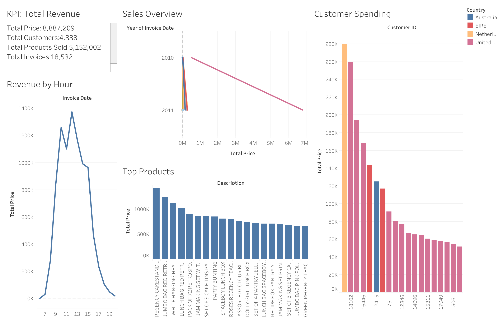

# Tableau Sales Performance Dashboard Report

# Tableau Sales Performance Dashboard Report

**Workbook:** `tableau/ecommerce_dashboard.twbx`  
**Data Source:** `data/processed/ecommerce_cleaned.csv`  
**Last Updated:** 18-Nov-2025

---

## 1. Dashboard Overview

The Tableau workbook transforms the cleaned Online Retail dataset into an interactive, executive-ready dashboard. Key features include:

- **Sales Overview:** Year-over-year revenue trends with dynamic filters for country and time period
- **KPI Metrics:** Total revenue, average order value, invoice count, and repeat customer rate
- **Customer & Product Analysis:** Top-spending customers, most profitable products, and revenue by country
- **Operational Insights:** Hourly revenue heatmap identifying peak trading windows for logistics optimization

---

## 2. Key Business Findings

| Metric | Value | Insight |
|--------|-------|---------|
| **Total Revenue** | £8.89M | `18,532` invoices processed |
| **Average Order Value** | £479.56 | High-ticket wholesale transactions |
| **Customer Retention** | 65.58% | Repeat purchase rate demonstrates loyalty |
| **Peak Trading Hour** | 12:00–13:00 | £1.37M cumulative revenue |
| **Top Market** | United Kingdom | 82% of revenue (£7.29M) |
| **Busiest Month** | November 2011 | £1.16M, aligned with pre-holiday demand |

**Top Performers:**
- **Hero Products:** PAPER CRAFT, LITTLE BIRDIE (£168K) and REGENCY CAKESTAND 3 TIER (£142K)
- **Key Customer:** Customer 14646 contributes £280K, highlighting importance of account management

---

## 3. Dashboard Visualizations

**3.0. Annie Related Analytics Dashboards**

- [Invoice Processing Dashboard](https://chat.pandas-ai.com/creations/a6d23172-1150-4237-b196-790ab3485b72/265aa43d-5837-40c5-8fae-97fd384ad642%2Finvoice_processing_dashboard.pxml)
- [Customer Spend Analysis Dashboard](https://chat.pandas-ai.com/creations/5a252998-6b40-4a12-ac99-59a18ae18142/8e8b2bce-4ec2-4709-a17d-31416345bc7e%2Fcustomer_spend_analysis_dashboard.pxml)
- [Product Sales Performance Dashboard](https://chat.pandas-ai.com/creations/d91929b1-b9c1-452a-9fc3-baee13768000/ab2bfe0e-36e5-4bd9-ab1f-bf2f7132f0bb%2Fdashboard.pxml)

**Tableaus Dashboard Visualizations**

**3.1 KPI Summary**  

**3.2 Sales Overview**  

**3.3 Revenue by Hour**  

**3.4 Top Customer Spending**  

**3.5 Top Products**  

---

