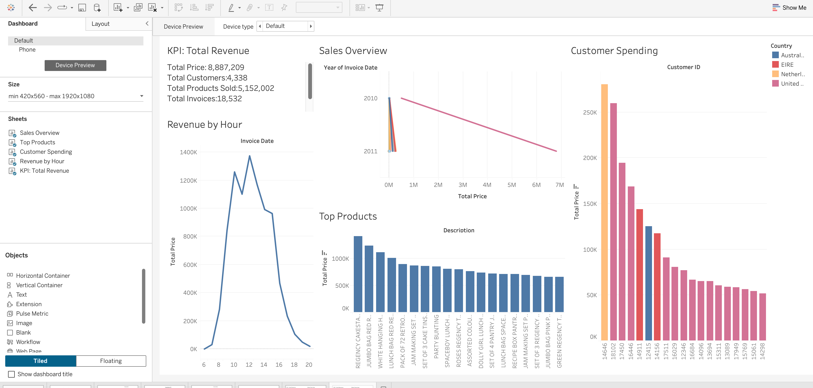

# Tableau Sales Performance Dashboard Report

**Workbook:** `tableau/ecommerce_dashboard.twbx`  
**Data Source:** `data/processed/ecommerce_cleaned.csv`  
**Last Updated:** 18-Nov-2025

---

## 1. Tableau Dashboard Overview

The Tableau workbook consolidates the cleaned Online Retail dataset into an executive-ready dashboard. The design focuses on:

- **Sales Overview:** YoY revenue trend with dynamic filters for country and time.
- **KPI Tiles:** Total revenue, average order value, invoice count, and repeat customer rate.
- **Customer & Product Deep-Dives:** Top-spending customers, most profitable products, and contribution by country.
- **Operational Timing:** Hourly revenue heatmap that highlights peak trading windows for logistics planning.

---

## 2. Key Business Findings

- **Total revenue:** £8.89M generated across `18,532` invoices.  
- **Average order value:** £479.56 per invoice, signaling high-ticket wholesale behavior.  
- **Customer retention:** `65.58%` of customers placed more than one order, reinforcing the need to nurture loyal buyers.  
- **Peak trading window:** 12:00–13:00 delivers the highest hourly revenue (£1.37M cumulative), suggesting midday promotions perform best.  
- **Leading countries:** United Kingdom drives 82% of revenue (£7.29M), followed by the Netherlands (£0.29M) and Ireland (£0.27M).  
- **Hero products:** `PAPER CRAFT , LITTLE BIRDIE` (£168K) and `REGENCY CAKESTAND 3 TIER` (£142K) dominate sales; both belong to seasonal gifting lines.  
- **Top customers:** Customer `14646` alone contributes £280K, indicating the importance of bespoke account management for key wholesalers.  
- **Busiest month:** November 2011 peaks at £1.16M, aligning with pre-holiday purchasing cycles.

---

## 3. Screenshot Reference Guide

**3.1 Dashboard Preview**  
  
Highlights the final composition with KPI tiles, revenue trend, hourly heatmap, and customer/product leaderboards. Use this to orient stakeholders before diving into specific worksheets.

**3.2 Dashboard (Published View)**  
  
Shows the interactive layout as published to Tableau Server/Desktop, confirming that filters (Country, Year, Month) and legends render correctly.

**3.3 Dashboard – Combine Tables Data Model**  
  
Documents how customer, invoice, and product tables were blended, useful for data lineage reviews.

**3.4 KPI Tile – Total Revenue**  
  
Single-card export used in presentations; reiterates the headline £8.89M metric with YoY delta annotation.

**3.5 Sales Overview Worksheet**  
  
Line chart of monthly revenue, highlighting the November 2011 peak (£1.16M). Use this when discussing seasonality.

**3.6 Revenue by Hour Worksheet**  
  
Heatmap showing 12:00–13:00 as the most lucrative slot (£1.37M cumulative). Supports operations planning.

**3.7 Top Customer Spending Worksheet**  
  
Bar chart ranking customers; customer 14646 leads with £280K. Ideal slide for account-management insights.

**3.8 Top Products Worksheet**  
  
Displays best-selling SKUs such as PAPER CRAFT, LITTLE BIRDIE (£168K) and REGENCY CAKESTAND 3 TIER (£142K) for merchandising decisions.

---

